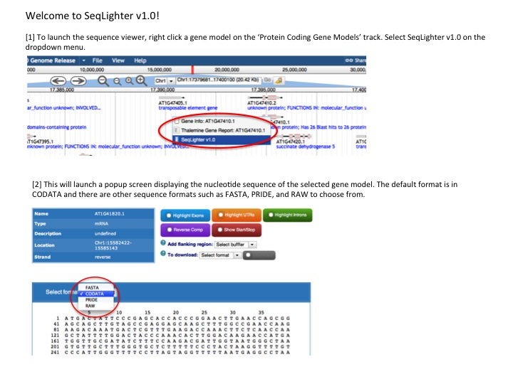

![AIP][1] SeqLighter v1.0
---

### How to Cite

### Description
SeqLighter is a dynamic sequence viewer plugin implemented using the [BioJS framework](http://biojs.net/).

The plugin is currently set up to work with feature tracks that use the `trackType` **HTMLFeatures**, and represent the `featureType` **mRNA** and their subfeatures (`five_prime_UTR`, `three_prime_UTR`, `exon`, `CDS`). 

First, the input GFF3 file would need to be processed like so:

	$ bin/flatfile-to-json.pl --gff data/raw/genes.gff3 --out data/json/arabidopsis \
	  --trackLabel athaliana_genes --key 'A. thaliana Gene Models' \
	  --nameAttributes "name,alias,id" --trackType "JBrowse/View/Track/HTMLFeatures" \
	  --type "mRNA" --subfeatureClasses '{ "exon": "transcript-exon", "CDS": "transcript-CDS", 
	  "five_prime_UTR" : 	"transcript-UTR", "three_prime_UTR" : "transcript-UTR" }'

Second, the plugin can be enabled using either of the following methods (see official [JBrowse documentation](http://gmod.org/wiki/JBrowse_Configuration_Guide#Using_Plugins) on using plugins):

`tracks.conf`

		[plugins]
		SeqLighter.location += ./plugins/SeqLighter

`trackList.json`

		"plugins": {
			"SeqLighter" : { "location" : "./plugins/SeqLighter" }
		}

Third, the plugin can be associated with a gene model track by adding a right click menu option (by updating the track configuration stanza) to trigger the sequence displayer in a popup contentDialog:

`trackList.json`

	{
    	"label" : "athaliana_genes",
        "key" : "A. thaliana Gene Models",
        "storeClass" : "JBrowse/Store/SeqFeature/NCList",
        "trackType" : null,
        "type" : "FeatureTrack",
        "urlTemplate" : "tracks/athaliana_genes/{refseq}/trackData.json",
        "style" : {
        	"className" : "feature"
        	"subfeatureClasses": {
           		"exon": "transcript-exon",
         		"CDS": "transcript-CDS",
         		"five_prime_UTR" : "transcript-UTR",
         		"three_prime_UTR" : "transcript-UTR"
         	}
        }
		"menuTemplate" : [
        	{
               "content" : "function(track,feature,div ){ return SequenceViewer(track, feature, div); }",
               "iconClass" : "dijitIconDatabase",
               "action" : "contentDialog",
               "label" : "View Sequence"
            }  
        	],
        	"compress" : 0
        },
	}

Finally, on successful configuration, the sequence viewer can be launched via a Right-Click (or Ctrl + Left-Click on a Mac) the gene model track. Then, select **View Sequence** in the drop down menu.

### Contributors

* [Maria Kim](https://github.com/msarmien) - JCVI
* [Vivek Krishnakumar](https://github.com/vivekkrish) - JCVI

* * *

If you have any questions regarding the usage of this plugin, please write to <mailto:araport@jcvi.org>

[1]: http://bit.ly/aip-logo
